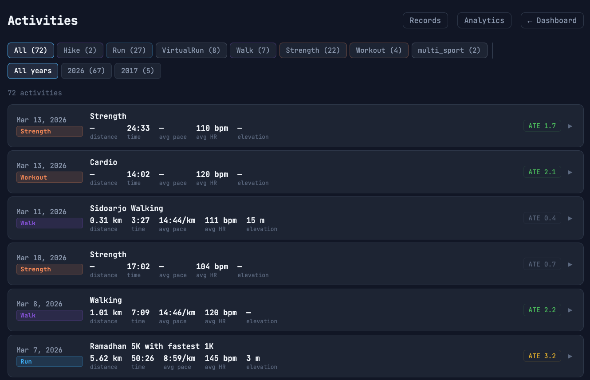
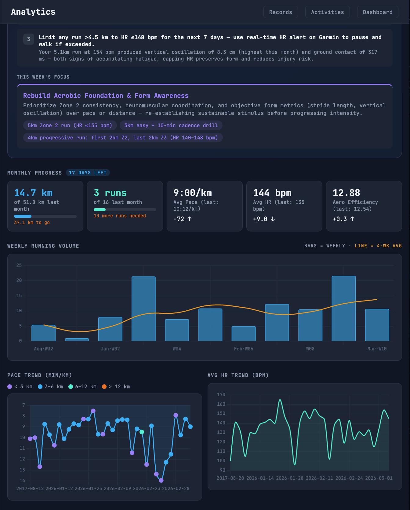
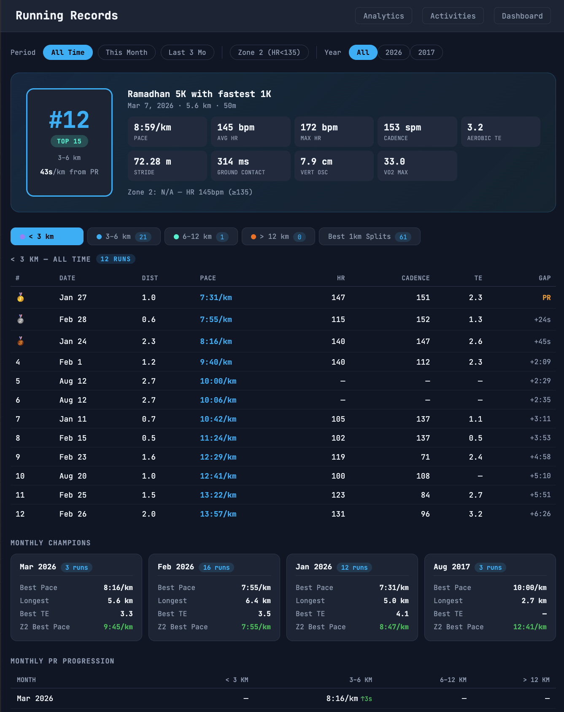
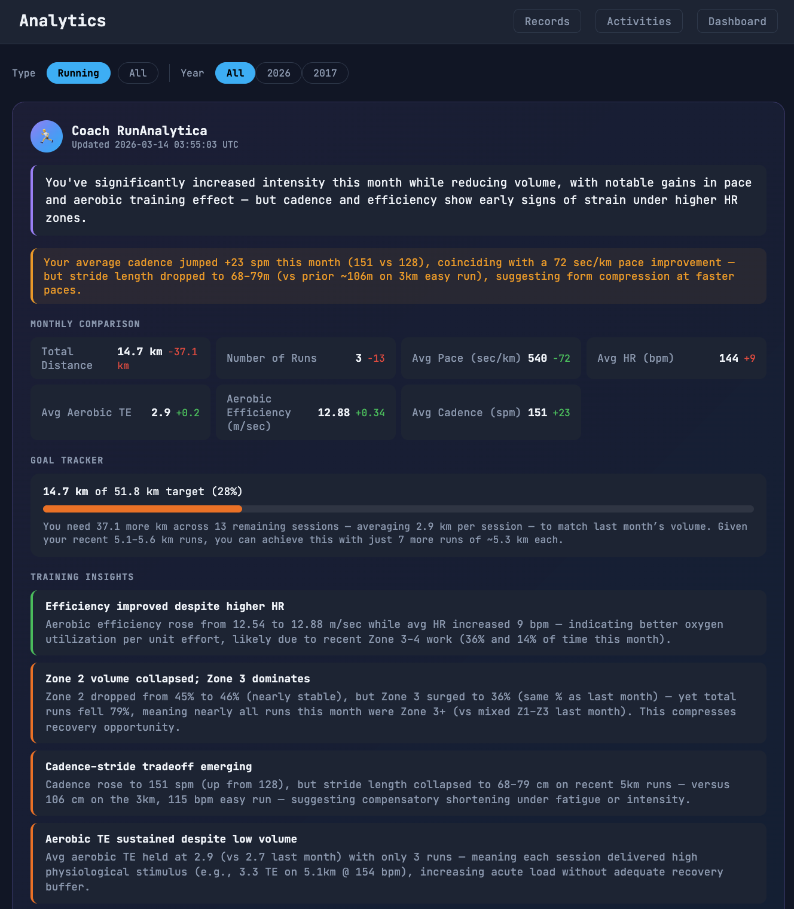
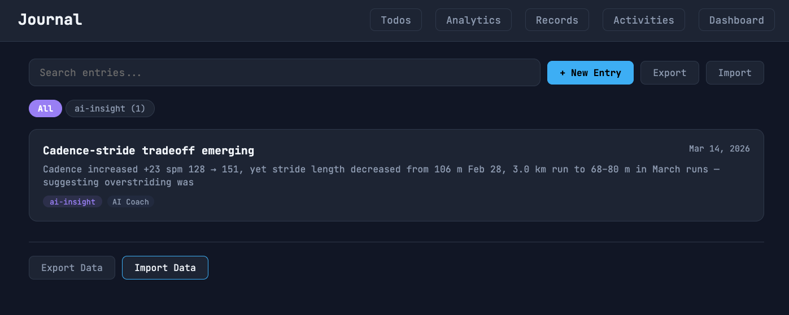
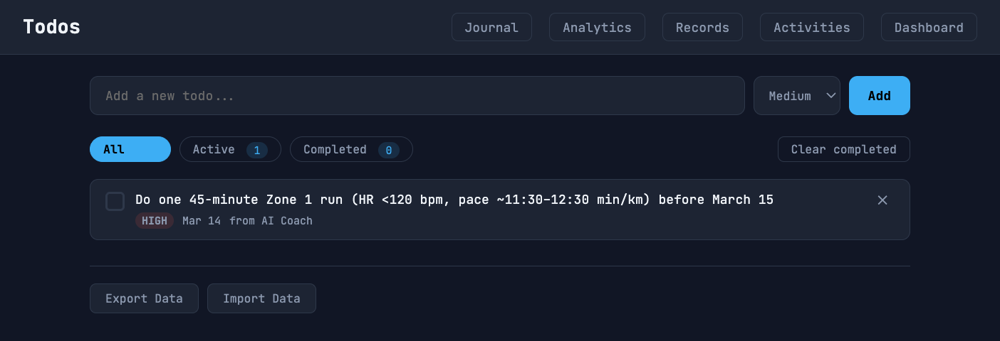

<p align="center">
  <br>
  <sub>
    (create your own README logo like this
    <a href="https://github.com/aspain/heatmap-logo">here</a>)
  </sub>
</p>

# Workout → Interactive Dashboard

> **Fork of [aspain/git-sweaty](https://github.com/aspain/git-sweaty)**
> All core infrastructure and pipeline credit goes to the original author.
> This fork adds Garmin-focused analytics, running records, and AI coaching on top.

Turn your **Garmin** activities into GitHub-style contribution graphs. Automatically generate a free, interactive dashboard updated daily on GitHub Pages.

**No coding required.**

View the Interactive [Activity Dashboard](https://guntarion.github.io/git-sports-guntar/).


---

## What's New in This Fork

Built on top of [aspain/git-sweaty](https://github.com/aspain/git-sweaty), this fork adds:

### 📊 Activities Page
Per-activity detail view with expandable cards:
- HR zone distribution (Z1–Z5 bars)
- Per-km split table (pace, HR, elevation)
- Running dynamics: cadence, stride length, ground contact, vertical oscillation, VO2 max



### 📈 Analytics Page
Comprehensive running analytics dashboard:
- **Monthly progress tracker** — distance & sessions vs. last month with progress bars
- **Weekly volume chart** — bars + 4-week rolling average line
- **Pace trend** — distance-colored points by band (< 3 km / 3–6 km / 6–12 km / > 12 km)
- **Aerobic efficiency trend** — `(speed / HR) × 1000` formula
- **HR zone comparison** — this month vs. last month
- **Running form trends** — ground contact time, stride length
- **Monthly summary table** — with delta indicators vs. prior month



### 🏆 Records Page
Personal running records and leaderboards:
- Leaderboards by distance band (< 3 km / 3–6 km / 6–12 km / > 12 km)
- Best 1 km splits ranking (short partial-km splits filtered out)
- Monthly champions and PR progression table
- Running form records (best cadence, stride, VO2 max, etc.)
- Split analysis: best negative splits & most consistent pacing



### 🤖 AI Coach (Coach RunAnalytica)
Powered by [Qwen](https://www.alibabacloud.com/en/product/modelstudio) (Alibaba DashScope — ACTOR prompt framework):
- Monthly performance review with metric-by-metric comparison
- Goal tracker: km remaining to match last month
- Training insights by category (aerobic efficiency, HR zones, form, load, recovery)
- 3 actionable recommendations per week
- Weekly focus theme with suggested sessions
- **Smart skip**: AI does not re-run if no new running data (saves API tokens)



### 📓 Journal & Todo List
Capture AI Coach recommendations and personal reflections, stored in browser localStorage:
- **Journal** — Markdown editor with search, tag filter, and preview toggle
- **Todo list** — Quick add with priority, filters (All/Active/Completed), bulk clear
- **Cross-page capture** — 📓 and ☐ buttons on AI recommendations in Analytics; 📓 Add Note on Records hero card
- **Data portability** — Export/Import JSON backup to move data across devices





### 🗄️ PostgreSQL Sync (Optional)
Sync all activities, splits, and HR zone data to a PostgreSQL database for external analytics queries.

---

## Quick Start (Garmin)

### macOS / Linux

```bash
bash <(curl -fsSL https://raw.githubusercontent.com/aspain/git-sweaty/main/scripts/bootstrap.sh)
```

### Windows (requires WSL)

```powershell
wsl bash -lc "bash <(curl -fsSL https://raw.githubusercontent.com/aspain/git-sweaty/main/scripts/bootstrap.sh)"
```

When prompted, choose:
- Source: **garmin**
- Unit preference: `US` or `Metric`
- Heatmap week start: `Sunday` or `Monday`

### Garmin Auth Secrets

After initial setup, add these in your repo:
`Settings → Secrets and variables → Actions → Secrets`

| Secret | Required | Description |
|--------|----------|-------------|
| `GARMIN_EMAIL` | One of the two | Garmin Connect account email |
| `GARMIN_PASSWORD` | One of the two | Garmin Connect account password |
| `GARMIN_TOKENS_B64` | Alternative | Base64-encoded OAuth token store |

### Optional Secrets

| Secret / Variable | Purpose |
|-------------------|---------|
| `QWEN_API_KEY` (secret) | Enable AI Coach panel in Analytics |
| `DATABASE_URL` (secret) | PostgreSQL sync for external queries |
| `DASHBOARD_GARMIN_PROFILE_URL` (var) | Profile link in dashboard header |
| `DASHBOARD_DISTANCE_UNIT` (var) | `km` or `mi` |
| `DASHBOARD_ELEVATION_UNIT` (var) | `m` or `ft` |
| `DASHBOARD_WEEK_START` (var) | `sunday` or `monday` |

### Trigger Manual Sync

```bash
# Incremental sync
gh workflow run "Sync Heatmaps" --field source=garmin

# Full backfill (re-fetch all history)
gh workflow run "Sync Heatmaps" --field source=garmin --field full_backfill=true
```

Or via GitHub UI: **Actions → Sync Heatmaps → Run workflow**

---

## Dashboard Pages

| Page | URL | Description |
|------|-----|-------------|
| Dashboard | `/` | GitHub-style heatmap, all activity types |
| Activities | `/activities.html` | Per-activity detail with HR zones & splits |
| Analytics | `/analytics.html` | Running charts, monthly progress, AI Coach |
| Records | `/records.html` | Leaderboards, PRs, split analysis |
| Journal | `/journal.html` | Training reflections, markdown notes |
| Todos | `/todos.html` | Action items from AI Coach & manual |

---

## Updating This Fork

To pull upstream improvements from [aspain/git-sweaty](https://github.com/aspain/git-sweaty):

1. Go to your fork on GitHub
2. Click **Sync fork** on the `main` branch
3. If there are conflicts in fork-specific files (`site/analytics.html`, `site/records.html`, `site/activities.html`, `scripts/generate_ai_insights.py`, `scripts/generate_activities.py`, `scripts/sync_db.py`), resolve them manually
4. After syncing, run **Sync Heatmaps** workflow to refresh the dashboard

Activity data lives on the `dashboard-data` branch — it is never affected by syncing `main`.

---

## Other Features (from upstream)

- Responsive design for desktop and mobile
- Click a heatmap cell to freeze the tooltip; click away to dismiss
- Multi-type days show as proportional split squares (one color per activity type)
- Raw activity files are not committed (`activities/raw/` is gitignored)
- Backfill state is persisted — if a full backfill is interrupted, the next run resumes from where it left off
- The **Sync Heatmaps** workflow has a `Reset backfill cursor` toggle for forced full re-fetch

---

## Configuration (Optional)

Base settings: `config.yaml` · Local overrides: `config.local.yaml` (gitignored)

| Setting | Default | Description |
|---------|---------|-------------|
| `source` | `garmin` | Data source |
| `sync.start_date` | — | Lower bound for history (`YYYY-MM-DD`) |
| `sync.lookback_years` | `5` | Rolling lower bound (if `start_date` unset) |
| `sync.recent_days` | `7` | Always sync recent N days |
| `activities.include_all_types` | `true` | Include all seen sport types |
| `activities.exclude_types` | `[]` | Explicit type exclusions |
| `units.distance` | `km` | `km` or `mi` |
| `units.elevation` | `m` | `m` or `ft` |
| `heatmaps.week_start` | `sunday` | `sunday` or `monday` |

---

## Credits

- **Original project**: [aspain/git-sweaty](https://github.com/aspain/git-sweaty) — all core pipeline, heatmap rendering, and GitHub Actions infrastructure
- **Garmin API integration**: built on [python-garminconnect](https://github.com/cyberjunky/python-garminconnect)
- **AI coaching**: [Qwen (DashScope)](https://www.alibabacloud.com/en/product/modelstudio) via OpenAI-compatible API
- **Logo generator**: [aspain/heatmap-logo](https://github.com/aspain/heatmap-logo)

---

<details>
<summary>Manual Setup (No Scripts)</summary>

### 1) Shared steps

1. Fork this repository on GitHub.
2. Enable GitHub Actions: `Settings → Actions → General`
3. Set GitHub Pages to deploy from Actions: `Settings → Pages → Source → GitHub Actions`
4. Add repository variables: `Settings → Secrets and variables → Actions → Variables`
   - `DASHBOARD_SOURCE`: `garmin`
   - `DASHBOARD_REPO`: your fork slug (e.g. `yourname/git-sports-guntar`)
   - `DASHBOARD_DISTANCE_UNIT`: `km` or `mi`
   - `DASHBOARD_ELEVATION_UNIT`: `m` or `ft`
   - `DASHBOARD_WEEK_START`: `sunday` or `monday`

### 2) Garmin auth secrets

`Settings → Secrets and variables → Actions → Secrets`

Add `GARMIN_EMAIL` + `GARMIN_PASSWORD`, or alternatively `GARMIN_TOKENS_B64`.

### 3) Run the first sync

1. `Actions → Sync Heatmaps → Run workflow`
2. Set source to `garmin`
3. Wait for sync to complete, then `Deploy Pages` runs automatically
4. Open: `https://YOUR_USERNAME.github.io/YOUR_REPO_NAME/`

</details>
